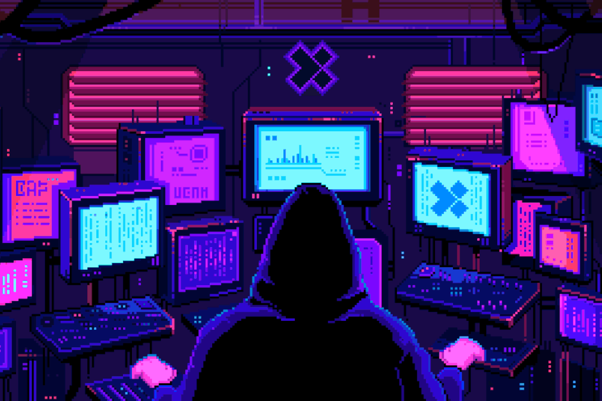

# 🕶️ Time Hacker

Willkommen bei **Time Hacker** – dem stylischen Arcade-Game, in dem du die Geschichte hackst!



## 🚀 Spielidee
Du bist ein Zeitreisender mit einer Mission: Stoppe die dunklen Pläne von Diktatoren und rette die Zukunft der Menschheit! Nutze deine Skills, weiche Hindernissen aus, sammle Power-Ups und hacke dich durch die Zeit.

## 🎮 Steuerung
- **Pfeil nach oben / unten:** Bewege deinen Charakter
- **Enter:** Dialoge fortsetzen
- **M:** Musik an/aus

## 🕹️ So startest du das Spiel
1. Stelle sicher, dass du Python installiert hast.
2. Starte im Projektordner einen lokalen Webserver:
   ```bash
   python3 -m http.server 8000
   ```
3. Öffne deinen Browser und gehe zu [http://localhost:8000](http://localhost:8000)

## ✨ Features
- Retro-Arcade-Style mit coolen Animationen
- Highscore-System
- Power-Ups für Unbesiegbarkeit
- Stylische 80s-Synthwave-Musik

## 📁 Projektstruktur
```
TimeHacker/
├── index.html
├── js/
│   ├── script.js
│   ├── game.js
│   └── ...
├── styles/
│   └── style.css
├── images/
│   └── ...
├── audio/
│   └── Kung_Fury_sound.mp3
└── README.md
```

## 👾 Credits
- Code & Design: [Dein Name]
- Musik: Kung Fury Soundtrack
- Pixel Art: Eigene Kreationen & freie Ressourcen

---

> **Time is your weapon. History is your battlefield.**

